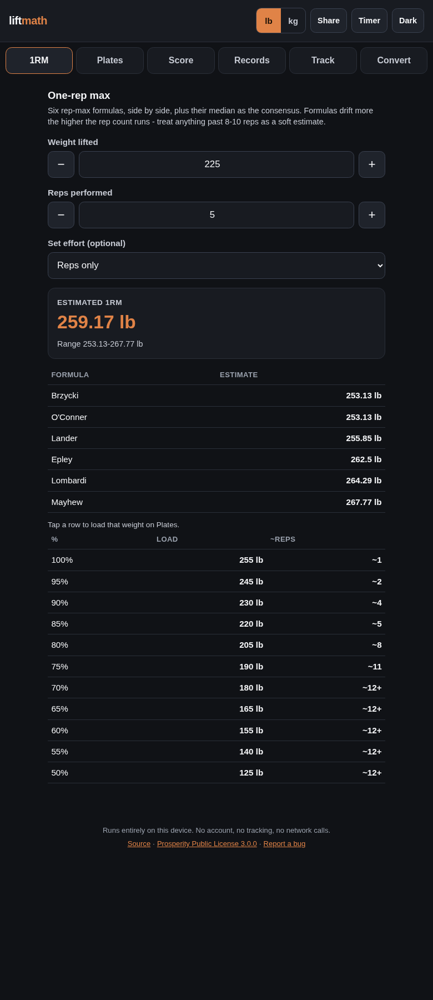

# liftmath

**A simple gym calculator. Three things you actually reach for mid-workout, done properly instead of eyeballed.**

[](https://github.com/munzzyy/liftmath/actions/workflows/ci.yml)
[](https://pypi.org/project/liftmath/)
[](LICENSE)


<p align="center">
  <a href="https://munzzyy.github.io/liftmath/"></a>
</p>

Three tools:

- **1RM**: estimate a one-rep max from any set you just did.
- **Plates**: what to hang on the bar for a target weight.
- **Strength score**: Wilks, DOTS, and IPF GL points, so you can compare across bodyweights.

Plus one lookup: **Records** - world records for powerlifting, strongman, and grip sport,
searchable by lift or event, sex, weight class, and equipment, with your own lift shown as a
percentage of the record.

That's it. It used to do a lot more; it does less now, on purpose. Every number traces back to a
named formula or a cited record, and you can read the whole thing in a sitting. There's also a
small lb/kg converter (`convert`) bolted on, since plates and strength score already needed exact
unit conversion internally - it's a utility, not another tool.

The fastest way in is the web app: nothing to install, works on your phone at the gym, offline,
and the barbell loads itself as you type: **https://munzzyy.github.io/liftmath/**. Everything below
is the same math for people who'd rather script it.

Pure Python standard library. No dependencies, no network calls, no accounts. Use it as a library
you import or a command you run.

## Install

```
pip install liftmath
```

Or from source:

```
git clone https://github.com/munzzyy/liftmath
cd liftmath
pip install -e .
```

Requires Python 3.10+. Nothing else.

## Command line

Pass `--json` (before or after the subcommand) to any command for machine-readable output instead
of text. Loads are unit-agnostic; pass `--unit kg` or `--unit lb` (default lb).

### 1RM

Estimate a one-rep max from a weight × reps set. No single formula is most accurate across every
rep range, so it runs six published equations and reports the median consensus instead of picking
one, dropping the curvilinear formulas past 12 reps where they're known to drift.

```
$ liftmath 1rm --weight 225 --reps 5
Estimated 1RM from 225lb x 5 reps
  No single formula is most accurate across every rep range, so this runs six and
  takes the CONSENSUS (median) instead of picking one. Sorted by value, not accuracy.
----------------------------------------------
  Brzycki    253.1lb
  O'Conner   253.1lb
  Lander     255.8lb
  Epley      262.5lb
  Lombardi   264.3lb
  Mayhew     267.8lb
----------------------------------------------
  CONSENSUS  259.2lb   (median; range 253.1-267.8)
```

### Plates

Which plates to load per side for a target barbell weight, largest first.

```
$ liftmath plates --target 315
Load 315lb on a 45lb bar:
  per side (135lb): 3x45
```

Home gym or travel kit with a finite set of plates? Pass `--inventory` with the exact per-side
counts you have and it solves against that instead of assuming an unlimited supply (an exhaustive
search, since greedy picks aren't optimal once supply runs out):

```
$ liftmath plates --target 405 --inventory 45x3,25x1,10x1
Load 405lb on a 45lb bar (from your inventory):
  per side (180lb): 3x45, 1x25, 1x10
  [!] can't make it exactly with this inventory - short 10lb/side.
      nearest achievable below: 385lb
```

There are also `--bar`, `--plates` (custom denominations), and `--preset` (`womens`, `metric-no-45`)
flags. Run `liftmath plates --help`.

### Strength score

Relative-strength scores from a total, bodyweight, and sex, so a lighter lifter and a heavier one
can be compared on one scale.

```
$ liftmath standards --total 1200 --bodyweight 200 --sex male
Relative-strength scores - 1200lb total @ 200lb bodyweight (male):
  Each score below lets you compare lifters across bodyweights on one scale - Wilks
  and DOTS are two different curve-fit formulas for it; IPF GL is the federation's own.
----------------------------------------
  Wilks (2020)      415.78
  Wilks (original)  346.09
  DOTS              350.55
  IPF GL points      72.08
----------------------------------------
```

All four are fit to different samples and disagree slightly, especially at the extremes of the
bodyweight range. Treat them as independent opinions, not one ground truth.

### Records

World records, bundled as a dated snapshot so lookups work offline like everything else here.
Powerlifting records are computed from the OpenPowerlifting project's public-domain database of
~4M sanctioned meet results, in two scopes: all-time (heaviest ever done in any sanctioned
federation) and tested (drug-tested meets only). Strongman and grip sport have no open database
anywhere, so those records are hand-curated, each entry carrying its own citation URL.

```
$ liftmath records --sport powerlifting --lift deadlift --sex male --bodyweight 220 --equip raw --compare 500
World records matching your filters (snapshot of 2026-07-11):
  ...
  [powerlifting] Deadlift 100 M raw (all-time)
      433.5kg (956lb)    Krzysztof Wierzbicki  (Siberian Championships, 2020-03-08)
      your 500lb = 52.3% of this record (456lb to go)
  [powerlifting] Deadlift 100 M raw (tested)
      400.5kg (883lb)    Hunter Olsen  (Age Division Nationals, 2026-05-19)
      your 500lb = 56.6% of this record (383lb to go)
```

Pass `--class` directly (`82.5`, `140+`, `open`) or `--bodyweight` and it resolves the
traditional class for you. `--sport strongman` and `--sport grip` cover the events with a real
documented record (log lift, atlas stone, keg toss, Rolling Thunder, Apollon's Axle, two hands
pinch, ...). `--json` carries the source URL, sanctioning body, and confidence grade for every
curated entry. Powerlifting rows are the empirical maxima in the data, NOT any federation's
official record list - federations curate those separately and reset them on rule changes.

### Convert

A plain lb/kg conversion, using the exact international avoirdupois pound (1 lb = 0.45359237 kg),
not a rounded approximation.

```
$ liftmath convert --weight 225 --unit lb
225lb = 102.06kg
(exact: 1lb = 0.45359237kg, the international avoirdupois pound)
```

## As a library

Every command is a thin wrapper around a plain function that returns a dataclass, so you can use the
math directly:

```python
from liftmath import estimate_one_rm, load_plates, score

est = estimate_one_rm(225, 5, unit="lb")
print(est.consensus)          # 259.17...

plates = load_plates(245, unit="lb")
print(plates.plates)          # [(45, 2), (10, 1)]

s = score(500, 90, "male")    # total kg, bodyweight kg, sex
print(s.wilks, s.dots, s.ipf_gl)
```

The full public API:

```python
from liftmath import (
    estimate_one_rm,                                       # six-formula 1RM consensus
    load_plates, load_plates_from_inventory,               # plate loading (unlimited / finite)
    score,                                                 # all four scores at once
    wilks_score, wilks_original_score,                     # Wilks 2020 / original
    dots_score, ipf_gl_points,                             # DOTS / IPF GL points
    search_records, weight_class_for, percent_of_record,   # world-record lookup
    records_as_of,                                         # dataset snapshot date
    lbs_to_kg, kg_to_lbs, convert_weight,                  # exact lb/kg conversion
    to_dict, to_json,                                      # serialize any result
)
```

Every result is a plain dataclass. To serialize one (an API response, a log line, whatever) use
`to_dict`/`to_json` rather than hand-rolling `dataclasses.asdict()`; they also carry over read-only
properties like `is_exact` and `exact` that `asdict()` alone would drop:

```python
from liftmath import estimate_one_rm, to_json
print(to_json(estimate_one_rm(225, 5, unit="lb")))
```

See the module docstrings in `src/liftmath/` for the details: `onerm.py`, `plates.py`, `standards.py`,
`records.py`, `convert.py`.

## Where the numbers come from

The 1RM formulas are Epley (1985), Brzycki (1993), Lombardi (1989), O'Conner et al. (1989),
Lander (1985), and Mayhew et al. (1992). Which of these actually degrades worse at high rep counts
is genuinely contested in the secondary literature, and `onerm.py`'s docstring documents that
openly rather than asserting an uncited fix.

The plate solver is a plain greedy largest-first pass for the unlimited case; the finite-inventory
solver does an exhaustive bounded search instead, because greedy isn't optimal once you can run out
of a plate (one 25 + one 25 beats grabbing the single 45 you own). `plates.py` explains why.

The strength scores come from the IPF's own published GL coefficients (May 2020), the original and
2020-revised Wilks formulas, and the DOTS formula introduced in 2019. These are competition scoring
conventions: the actual formulas federations use, fit by regression to real competition samples,
not "evidence" in the causal sense. The Wilks and DOTS coefficient tables are cross-checked against
OpenPowerlifting's implementations; IPF GL came straight from the IPF's own coefficients PDF.
`standards.py` has the full citations and a note on when the IPF table is due to refresh.

The world records come in two layers. Powerlifting is computed by `tools/build_records.py` from
the OpenPowerlifting project's bulk CSV (public domain, refreshed daily -
[openpowerlifting.org](https://www.openpowerlifting.org)): the best sanctioned lift per sex,
equipment, traditional weight class, and lift, in all-time and drug-tested scopes, with doping
disqualifications excluded. Strongman and grip sport publish no machine-readable records at all,
so `tools/data/curated_records.json` holds hand-verified entries - each with a citation URL,
sanctioning body, and a confidence grade - and its header documents what was deliberately left
out (events with no standardized implement, or marks with no verifiable source). The bundle is a
dated snapshot; records move, so `tools/build_records.py`'s docstring explains how to regenerate
it from a fresh CSV.

The lb/kg conversion uses the exact international avoirdupois pound (1 lb = 0.45359237 kg, fixed
by the 1959 international yard-and-pound agreement), not a rounded approximation. It's the same
factor `standards.py` was already converting with internally for its `--unit lb` handling.

## What this is not

This computes training math. It doesn't design your program, pick your exercises, or replace a coach
who can watch you lift. Informational and educational only, not medical advice.

## Tests

```
pip install -e ".[dev]"   # or: pip install pytest ruff
pytest
ruff check .
```

Every formula is pinned against hand-checked reference values in `tests/`. The web app's JavaScript
math is parity-tested against the Python reference so the two never drift.

## Contributing

Questions and contributions are welcome. See [CONTRIBUTING.md](CONTRIBUTING.md).

## License

[Prosperity Public License 3.0.0](LICENSE): free for noncommercial use. Commercial use gets a
30-day free trial, then requires a paid license. See `LICENSE` for the full terms.
