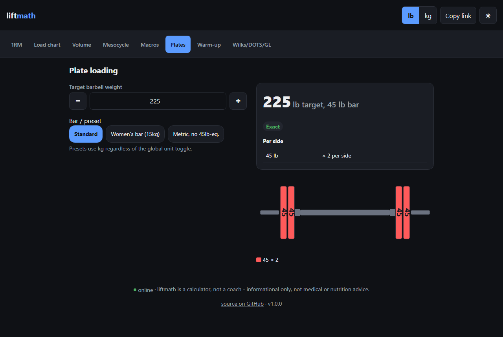

# liftmath

Strength training math, done properly instead of eyeballed. Estimate a 1RM from
any set, build a percentage-based load chart, look up weekly volume landmarks
per muscle, ramp a mesocycle, set macro targets, and figure out plate loading
and warm-up ramps.

Pure Python standard library. No dependencies, no network calls, no accounts.
Works as a library you import or a command you run.

## Why

Most lifting apps either hide the math behind a subscription or get it wrong
in some small, annoying way. liftmath is the opposite: every number traces
back to a named formula or a cited source, and you can read the whole thing
in a sitting. If you want to know exactly why it told you 259 lbs instead of
260, the answer is in the code, not a black box.

A few things it does differently from a typical single-formula calculator:
1RM estimates run six published equations and report the median instead of
picking one and hoping, with the curvilinear ones automatically dropped past
12 reps where they're known to drift. Macro targets enforce their own math -
protein, fat, and carbs are checked to actually sum to the calorie target,
and you get a warning instead of silently wrong numbers if the protein-and-fat
floor doesn't fit. Program auditing resolves exercise names to muscle
fractions with a longest-match rule, so "Leg Extension" and "Leg Curl" don't
collide with unrelated lifts that share a word.

## Install

Not on PyPI yet, so install straight from GitHub:

```
pip install git+https://github.com/munzzyy/liftmath
```

Or from a local clone:

```
git clone https://github.com/munzzyy/liftmath
cd liftmath
pip install -e .
```

Requires Python 3.10+. Nothing else.

## Command line

```
liftmath 1rm --weight 225 --reps 5 --unit lb
liftmath reps --onerm 315 --unit lb
liftmath target --onerm 315 --reps 8 --rir 2 --unit lb
liftmath rpe --reps 5 --rpe 8
liftmath volume --muscle chest --sets 14
liftmath program --exercise "Bench Press | 4x2" --exercise "Barbell Row | 4x2"
liftmath meso --muscle chest --weeks 5
liftmath progression --reps-low 8 --reps-high 12 --weight 185 --reps-achieved 12 --increment 5
liftmath macros --bodyweight 185 --goal gain --unit lb
liftmath cunningham --lean-mass 154 --unit lb
liftmath bulkcut --bodyweight 185 --goal gain --tier intermediate --unit lb
liftmath ffmi --weight 200 --unit lb --height 70 --bodyfat 12
liftmath navybf --sex male --height 70 --neck 15 --waist 34
liftmath sessionload --load 900 50 840 280 180 390 50 390 280
liftmath plates --target 245 --unit lb
liftmath warmup --weight 275 --unit lb
liftmath standards --total 1100 --bodyweight 220 --sex male --unit lb
liftmath mcculloch --total 300 --age 50 --unit kg
```

Run `liftmath <command> --help` for the full flag list on any of them.

Add `--json` (before or after the subcommand) to get the same result as JSON
instead of formatted text, for piping into another tool or script:

```
$ liftmath 1rm --weight 225 --reps 5 --json
{
  "weight": 225.0,
  "reps": 5,
  "unit": "lb",
  "per_formula": {"Epley": 262.5, "Brzycki": 253.125, "...": "..."},
  "consensus": 259.17253238856380,
  "low": 253.125,
  "high": 267.7740310159191,
  "high_rep_warning": false,
  "soft_estimate_warning": false,
  "is_exact": false
}
```

### 1RM estimate

Give it a weight and a rep count, it runs six published rep-max formulas and
reports the median as a consensus, plus a working-load table off that number.

```
$ liftmath 1rm --weight 225 --reps 5
Estimated 1RM from 225lb x 5 reps
----------------------------------------------
  Brzycki    253.1lb
  O'Conner   253.1lb
  Lander     255.8lb
  Epley      262.5lb
  Lombardi   264.3lb
  Mayhew     267.8lb
----------------------------------------------
  CONSENSUS  259.2lb   (median; range 253.1-267.8)
```

Accuracy holds up best under about 8 reps. Past 12, the curvilinear formulas
drift hard and get dropped from the consensus automatically, with a warning
printed so you know the estimate is soft.

### Load chart and target loads

`reps` prints the standard %1RM-to-reps-to-training-goal table from a known
1RM. `target` goes the other way: give it a rep count (and optionally a RIR)
and it tells you what to load.

### RPE / RIR

`rpe` converts between reps performed, RPE (rated exertion, 10 = failure),
and %1RM - either direction. It's derived from the same Epley-based model as
`reps`/`target`, not the popular RTS/Tuchscherer chart: that chart is mostly
a practitioner heuristic (Zourdos 2016, the peer-reviewed anchor, only
directly measured 3 points), so this keeps one internally-consistent
rep-max model instead of two tables that will occasionally disagree, and
says so in the output.

### Volume landmarks

`volume` prints or looks up the weekly hard-set landmarks per muscle group
(MV/MEV/MAV/MRV, the Renaissance Periodization framework), and can grade a
set count you give it against those bands. These numbers are a practitioner
framework (Israetel/RP's own coaching materials), not a peer-reviewed
per-muscle table - the CLI output says so every time, not just this file.

`program` takes a whole training split as a list of exercises and totals up
weekly sets per muscle automatically, using known fractional contributions
for common lifts (a bench press counts fully for chest and partially for
triceps and delts, for example), then grades every muscle against its
landmarks.

### Mesocycle ramp and double progression

`meso` builds a week-by-week set progression from MEV to MRV for one muscle
across a block, ending in a deload week. `progression` handles the other
axis - load and reps within a session - by computing the standard
double-progression decision (add a rep, or add load and reset to the bottom
of the range) from a rep range and the set you just did.

### Macros, Cunningham TDEE, and bulk/cut rates

`macros` computes protein, fat, and carb targets from bodyweight and a goal
(gain, maintain, recomp, cut). If you don't supply a known TDEE it estimates
one from an activity level, and it always flags you if the protein-and-fat
floor is higher than the calorie target you asked for, instead of quietly
printing numbers that don't add up.

`cunningham` computes an alternative TDEE from lean (fat-free) mass instead
of total bodyweight - a meaningfully better estimate for lean, trained
individuals specifically (shown to overestimate for a general, non-athlete
population), so it's offered alongside `macros`' bodyweight-based estimate
rather than replacing it.

`bulkcut` turns "gain/lose ~0.25-0.5% bodyweight/week" into an actual weekly
kg/lb target, banded by trainee tier (novice/intermediate/advanced), with
the lean:fat partition trade-off from Garthe (2013) shown explicitly -
slower bulks partition leaner, and the tool says so rather than hiding it
behind one number.

### Body composition

`ffmi` computes fat-free mass index (Kouri et al., 1995) from weight, height,
and body-fat %, height-normalized to a 1.80m reference, and flags when it's
above the 25.0 ceiling from that study's non-steroid-user sample (a
reference point from one 1995 sample of 157 male athletes, not a hard
physiological law).

`navybf` estimates body-fat % from tape-measure circumferences (Hodgdon &
Beckett, 1984, the U.S. Navy method) - a field-expedient estimate good for
tracking a trend, with a reported error band of about +/-3-4 percentage
points versus hydrostatic weighing, not a clinical-grade reading.

### Session load, monotony, and strain

`sessionload` takes a week of logged session loads (RPE x duration in
minutes per session) and computes weekly load, monotony (how uniform the
week was), and strain (Foster et al., 2001). Session-RPE itself is a
well-validated load measurement; monotony and strain as injury/illness
*predictors* are only a hypothesis the source paper floats, not a finding it
proves - treat them as descriptive training-diary numbers.

### Plates and warm-ups

`plates` solves plate loading for a target barbell weight with a standard or
custom plate set. Pass `--preset womens` for a 15kg bar or `--preset
metric-no-45` for a metric gym with no 45lb-equivalent plate, instead of
spelling out `--bar`/`--plates` by hand - presets are kg-only, so pair them
with `--unit kg`. `warmup` builds a five-step ramp up to a working weight.

### Relative-strength scoring

`standards` scores a competition total (or a single lift) against bodyweight
using four published formulas side by side: Wilks (original and the 2020
revision), DOTS, and IPF GL points. They're reported together rather than as
one number because each is fit to a different sample and they disagree
slightly, especially at the extremes of the bodyweight range - useful for
comparing lifters across weight classes, not for treating any single score
as gospel.

`mcculloch` age-adjusts a total for masters lifters (WRPF's published
coefficient table, ages 40-90), the same idea as the bodyweight-normalizing
formulas above but normalizing for age instead.

## Web app

liftmath also ships as a static web app: the same math as the CLI, in your
browser, with a barbell you can actually see get loaded. It's live at
https://munzzyy.github.io/liftmath/ (deployed straight from `web/` by CI on
every push to main), and it's a plain static site, so any other static host
works too.



Everything runs client-side. No server, no account, no analytics, no ads, no
CDN - open the page once and it works offline after that (it's a PWA, so you
can add it to your home screen). Eight tools in one page, tab-switchable:
1RM consensus, a %1RM/RIR load chart, weekly volume landmarks, a mesocycle
set ramp, macro targets, plate loading (with an SVG barbell render and a
women's-bar preset), a warm-up ramp, and Wilks/DOTS/IPF GL scores. Every
input recomputes instantly - no submit button - and your inputs live in the
URL so a result is just a link you can send someone.

The JavaScript in `web/js/math/` is hand-mirrored from the Python in
`src/liftmath/` and checked against it: `tools/gen_fixtures.py` runs the
Python reference across an edge-case input matrix and writes the results to
`tests/web/fixtures/`, and `node --test "tests/web/*.test.mjs"` asserts the
JS agrees with those fixtures within a tight epsilon. Python never ships to
the browser - it's the spec, not the runtime.

To run it locally:

```
cd web
python -m http.server 8000
```

(That's `py -m http.server 8000` if your Windows install only has the `py`
launcher on PATH.)

then open `http://localhost:8000`.

## As a library

Every CLI subcommand is a thin wrapper around a plain function that returns a
dataclass, so you can use the math directly:

```python
from liftmath import estimate_one_rm, macro_targets, load_plates

est = estimate_one_rm(225, 5, unit="lb")
print(est.consensus)   # 259.17...

m = macro_targets(185, "cut", unit="lb", tdee=2800)
print(m.protein_g, m.carb_g)

plates = load_plates(245, unit="lb")
print(plates.plates)   # [(45, 2), (10, 1)]
```

The rest of the public API, one function/dataclass pair per feature:

```python
from liftmath import (
    pct_1rm_from_reps_and_rpe, rpe_from_reps_and_pct,     # RPE/RIR <-> %1RM
    next_progression_step,                                 # double progression
    cunningham_tdee,                                        # lean-mass TDEE
    rate_target,                                            # bulk/cut rate target
    ffmi, navy_body_fat,                                    # body composition
    weekly_load, session_load,                              # Foster session load/monotony/strain
    score, wilks_score, wilks_original_score,
    dots_score, ipf_gl_points,                              # relative-strength scoring
    mcculloch_score, mcculloch_coefficient,                 # masters age adjustment
)

rpe_est = pct_1rm_from_reps_and_rpe(reps=5, rpe=8)
print(rpe_est.pct_1rm)   # ~0.81

step = next_progression_step(reps_low=8, reps_high=12, current_weight=185,
                              reps_achieved=12, increment=5)
print(step.next_weight, step.next_target_reps)   # 190 8

masters = mcculloch_score(300, age=50)
print(masters.adjusted_total)   # 345.0
```

Every result is a plain dataclass. To serialize one (for an API response, a
log line, whatever), use `to_dict`/`to_json` rather than hand-rolling
`dataclasses.asdict()` yourself, they also carry over read-only properties
like `is_exact` and `exact` that `asdict()` alone would drop:

```python
from liftmath import estimate_one_rm, to_json

print(to_json(estimate_one_rm(225, 5, unit="lb")))
```

See the module docstrings in `src/liftmath/` for the full API; each module
covers one area: `onerm.py`, `loads.py`, `rpe.py`, `volume.py`, `program.py`,
`mesocycle.py`, `progression.py`, `macros.py`, `bulkcut.py`, `bodycomp.py`,
`sessionload.py`, `plates.py`, `warmup.py`, `standards.py`.

## Where the numbers come from

The 1RM formulas come from Epley (1985), Brzycki (1993), Lombardi (1989),
O'Conner et al. (1989), Lander (1985), and Mayhew et al. (1992). Which of
these actually degrades worse at high rep counts is genuinely contested in
the secondary literature (some sources say the curvilinear forms hold up
*better* past ~10-12 reps, not worse) - `onerm.py`'s docstring documents
that openly rather than asserting an uncited fix either way.

The RPE/RIR axis (`rpe.py`) is derived from the same Epley-based model as
the rest of this library, not the popular RTS/Tuchscherer chart - Zourdos et
al. (2016), the peer-reviewed anchor for RPE/RIR, only directly measured 3
points, and the rest of that popular chart is a practitioner heuristic, not
validated data.

The volume landmarks (MV/MEV/MAV/MRV) come from Mike Israetel and Renaissance
Periodization's volume landmark framework - a practitioner framework, not a
peer-reviewed per-muscle table, and the CLI says so - cross-checked against
dose-response meta-analyses from Schoenfeld, Grgic & Krieger (2017),
Baz-Valle et al. (2022), and Pelland, Robinson & Nuckols (2024). These are
population starting points to titrate from, not fixed rules — the research
shows high responders can productively exceed them.

The RIR-and-hypertrophy note comes from Refalo et al. (2023), a systematic
review and meta-analysis showing training 0-3 reps short of failure builds
muscle about as well as training to failure at matched volume.

The protein target comes from a Morton et al. (2018) meta-analysis putting
about 1.6 g/kg as the point of diminishing returns for hypertrophy, with
intakes up to about 2.2 g/kg shown safe, raised further in a deficit per
Helms, Aragon & Fitschen (2014). The Cunningham (1980) TDEE alternative uses
fat-free mass and is backed by a 2023 systematic review specifically for
athlete populations - not a universal replacement for the bodyweight-based
estimate. Bulk/cut rate targets and the lean:fat partition trade-off come
from Garthe et al. (2013), a single (if well-designed) trial in elite
athletes, blended with Rozenek et al. (2002) and Helms's practitioner
synthesis for the trainee-tier bands.

FFMI comes from Kouri, Pope, Katz & Oliva (1995); the 25.0 reference ceiling
is from that study's specific 157-person male-athlete sample, not a general
law. Navy tape-measure body-fat % comes from Hodgdon & Beckett (1984), a
U.S. Navy validation study against hydrostatic weighing.

Session load, monotony, and strain come from Foster et al. (2001) - the
session-RPE measurement method itself is well-validated; monotony and strain
as injury/illness predictors are presented as descriptive numbers only, per
that paper's own more cautious framing of that specific claim.

The relative-strength scores come from the IPF's own published GL
coefficients (May 2020), the original and 2020-revised Wilks formula, and
the DOTS formula introduced in 2019 as a bodyweight-independent alternative
to Wilks. The McCulloch age-coefficient table for masters lifters comes from
the WRPF's own published 2022 document.

Full citations are in the relevant module's docstring, not just this file.

## What this is not

This computes training math. It does not design your program, pick your
exercises, or replace a coach who can watch you lift. It's informational
and educational only, not medical or nutrition advice — talk to a doctor
or registered dietitian before making major changes to your training or
diet, especially if you have an existing health condition. TDEE estimates
in particular are rough; track your bodyweight for a couple of weeks and
adjust to the real trend rather than trusting the estimate blindly.

## Tests

```
pip install -e ".[dev]"  # or: pip install pytest ruff
pytest
ruff check .
```

Every formula and volume-band boundary is pinned against hand-checked
reference values in `tests/`.

## License

[Prosperity Public License 3.0.0](LICENSE) — free for noncommercial use. Commercial use gets
a 30-day free trial, then requires a paid license. See `LICENSE` for the full terms.
